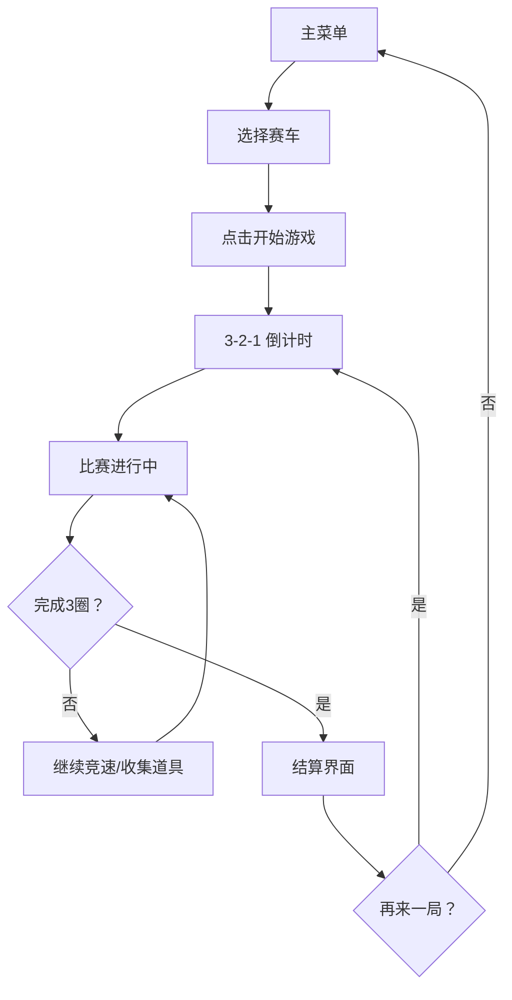

## 1. 产品概述
像素风赛车游戏，灵感来源于跑跑卡丁车，采用 HTML5 Canvas 实现俯视角 2D 赛车竞速体验。
- 面向喜欢复古像素游戏和休闲竞速游戏的玩家，提供快节奏、易上手的赛车乐趣
- 核心价值：怀旧像素美学 + 爽快漂移手感 + 道具对战玩法

## 2. 核心功能

### 2.1 用户角色
| 角色 | 注册方式 | 核心权限 |
|------|----------|----------|
| 玩家 | 无需注册，直接游玩 | 选择赛车、开始游戏、使用道具、查看成绩 |

### 2.2 功能模块
1. **主菜单页**：游戏标题、开始按钮、操作说明、赛车选择
2. **游戏界面**：Canvas 赛道渲染、赛车控制、HUD 信息面板、倒计时
3. **结算界面**：排名显示、用时统计、重玩/返回菜单

### 2.3 页面详情
| 页面名称 | 模块名称 | 功能描述 |
|----------|----------|----------|
| 主菜单 | 标题区 | 像素风游戏 Logo 动画，闪烁特效 |
| 主菜单 | 赛车选择 | 3 辆不同颜色/属性赛车可选，显示速度/加速/操控 |
| 主菜单 | 操作说明 | WASD/方向键控制、漂移、道具键位说明 |
| 游戏界面 | 赛道渲染 | 像素风格环形赛道，包含草地、路肩、加速带 |
| 游戏界面 | 赛车物理 | 前进/后退/转向/漂移/加速带效果 |
| 游戏界面 | AI 对手 | 3 辆 AI 赛车按照路径点自动行驶 |
| 游戏界面 | 道具系统 | 随机道具箱：加速、护盾、香蕉皮、导弹 |
| 游戏界面 | HUD | 速度表、当前名次、圈数、计时器、道具栏 |
| 游戏界面 | 倒计时 | 3-2-1-GO 开场动画 |
| 结算界面 | 成绩展示 | 玩家排名、总用时、最佳圈速、AI 成绩对比 |
| 结算界面 | 操作按钮 | 再来一局、返回主菜单 |

## 3. 核心流程
玩家进入主菜单 → 选择赛车 → 点击开始 → 3秒倒计时 → 比赛开始（3圈竞速） → 收集道具/使用道具/漂移过弯 → 冲线完成 → 显示结算界面 → 重玩或返回菜单

## 4. 用户界面设计

### 4.1 设计风格
- **主色调**：深夜蓝 (#0a0a1a) 背景 + 霓虹绿 (#00ff88) 高亮 + 赛车红 (#ff3366) / 闪电黄 (#ffdd00) / 天空蓝 (#33ccff)
- **按钮风格**：像素风立体按钮，带 4px 深色描边，hover 时上移 2px 产生按压效果
- **字体**：Press Start 2P 像素字体，所有文字使用该字体营造复古感
- **布局风格**：全屏沉浸式，Canvas 居中占满，HUD 信息固定四角
- **图标风格**：纯像素绘制 Emoji 风格道具图标

### 4.2 页面设计概述
| 页面名称 | 模块名称 | UI 元素 |
|----------|----------|---------|
| 主菜单 | 标题区 | 大号像素字 "PIXEL KART"，逐字弹跳入场动画，霓虹发光效果 |
| 主菜单 | 赛车卡片 | 3 张并排卡片，选中状态边框高亮发光，属性条进度显示 |
| 主菜单 | 开始按钮 | 大尺寸绿色像素按钮，脉冲发光动画 |
| 游戏界面 | 赛道 | 深灰柏油路 + 白色虚线分隔 + 红绿路肩 + 黄色加速带闪烁 |
| 游戏界面 | 赛车 | 16x16 像素车体，根据方向旋转，漂移时产生灰色轮胎印 |
| 游戏界面 | HUD | 左上圈数/计时，右上速度表，左下名次，右下道具栏 |
| 游戏界面 | 倒计时 | 屏幕中央超大数字，缩放弹跳动画 |
| 结算界面 | 排名榜 | 1-4名赛车卡片 + 用时，玩家行高亮闪光 |
| 结算界面 | 按钮区 | 两个并排按钮：重玩（绿）/ 返回（灰） |

### 4.3 响应式
- Desktop 优先设计，Canvas 保持 16:9 比例居中
- 窗口缩放时 Canvas 等比缩放，保持像素清晰
- 移动端：屏幕触控支持（左右转向虚拟按钮 + 加速/刹车）

### 4.4 场景氛围
- 赛道周围：像素化树木、草地纹理、观众席方块
- 动态效果：漂移烟雾粒子、加速带光效、道具拾取闪光、导弹尾焰
- 后处理：整体 scanline 扫描线滤镜增强复古 CRT 感
