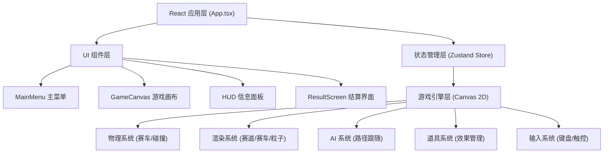

## 1. 架构设计


## 2. 技术描述
- **前端框架**：React@18 + TypeScript@5.8
- **构建工具**：Vite@6.3
- **样式方案**：TailwindCSS@3.4 + 自定义像素风 CSS
- **状态管理**：Zustand@5 (游戏全局状态：阶段/赛车/分数/道具)
- **游戏渲染**：HTML5 Canvas 2D API (原生，无需额外引擎库)
- **字体**：Google Fonts - Press Start 2P (像素字体)
- **UI 图标**：Lucide React (辅助图标，主要采用像素自绘)

## 3. 路由定义
本项目为单页面游戏应用，不使用多页面路由，通过 Zustand 中的 `phase` 状态切换界面：
| 状态值 | 对应界面 |
|--------|----------|
| `menu` | 主菜单 (赛车选择 + 操作说明) |
| `countdown` | 倒计时阶段 (3-2-1-GO) |
| `racing` | 比赛进行中 |
| `finished` | 结算界面 |

## 4. 核心数据结构定义

### 4.1 游戏全局状态 (Zustand Store)
```typescript
type GamePhase = 'menu' | 'countdown' | 'racing' | 'finished';

interface Car {
  id: number;
  name: string;
  color: string;
  x: number;
  y: number;
  angle: number;
  speed: number;
  maxSpeed: number;
  acceleration: number;
  handling: number;
  isPlayer: boolean;
  lap: number;
  checkpoint: number;
  bestLapTime: number;
  currentLapTime: number;
  totalTime: number;
  hasShield: boolean;
  boostTime: number;
  currentItem: ItemType | null;
  drifting: boolean;
}

type ItemType = 'boost' | 'shield' | 'banana' | 'missile';

interface GameState {
  phase: GamePhase;
  selectedCarId: number;
  countdown: number;
  cars: Car[];
  totalLaps: number;
  winnerId: number | null;
  rankings: number[];
  // actions
  setPhase: (p: GamePhase) => void;
  selectCar: (id: number) => void;
  startGame: () => void;
  updateCars: (cars: Car[]) => void;
  finishRace: (winnerId: number) => void;
  resetGame: () => void;
}
```

### 4.2 赛道数据结构
```typescript
interface TrackPoint {
  x: number;
  y: number;
  width?: number; // 可选：赛道宽度变化
}

interface Track {
  name: string;
  points: TrackPoint[];   // 赛道中心线路径点
  width: number;          // 赛道宽度
  checkpoints: number[];  // 检查线索引
  boostZones: number[];   // 加速带区域索引
}
```

### 4.3 道具数据
```typescript
interface ItemBox {
  x: number;
  y: number;
  collected: boolean;
  respawnTimer: number;
}

interface Banana {
  x: number;
  y: number;
  active: boolean;
}

interface Missile {
  x: number;
  y: number;
  angle: number;
  targetId: number;
  active: boolean;
}
```

## 5. 游戏引擎模块划分

### 5.1 物理系统 (`src/engine/physics.ts`)
- 赛车运动学模型：加速度、摩擦力、最大速度
- 转向计算：根据速度动态调整转向灵敏度
- 漂移机制：侧滑角度计算 + 轮胎印生成
- 赛道碰撞检测：点到线段距离判定是否出界
- 赛车间碰撞：圆形碰撞检测 + 分离响应

### 5.2 渲染系统 (`src/engine/renderer.ts`)
- 赛道绘制：路填充 + 路肩条纹 + 加速带闪烁
- 赛车绘制：像素车体旋转渲染 + 漂移尾焰
- 粒子系统：烟雾/火花/道具闪光
- 摄像机跟随：平滑 lerp 跟随玩家赛车
- HUD 覆盖：速度表/圈数/名次/道具图标

### 5.3 AI 系统 (`src/engine/ai.ts`)
- 路径点跟随：寻找最近路径点，计算期望角度
- 速度自适应：弯道减速、直线加速
- 道具使用策略：AI 根据位置自动使用道具
- 难度微调：不同 AI 有轻微属性差异

### 5.4 道具系统 (`src/engine/items.ts`)
- 道具箱随机生成道具类型
- 加速 boost：3秒内最高速度 +50%
- 护盾 shield：8秒内免疫一次攻击/香蕉
- 香蕉 banana：放置后方，踩到打滑
- 导弹 missile：自动锁定前方赛车并命中减速

### 5.5 输入系统 (`src/engine/input.ts`)
- 键盘监听：W/↑加速, S/↓刹车, A/←左转, D/→右转, Space 漂移/使用道具
- 状态快照：每帧读取输入状态供物理系统使用
- 支持同时多键按下

## 6. 文件目录结构
```
src/
├── App.tsx              # 根组件，根据 phase 切换界面
├── main.tsx             # 入口
├── index.css            # 全局样式 + 像素字体 + 动画
├── store/
│   └── gameStore.ts     # Zustand 全局状态管理
├── components/
│   ├── MainMenu.tsx     # 主菜单组件
│   ├── GameCanvas.tsx   # Canvas 画布 + 游戏循环
│   ├── HUD.tsx          # 覆盖层 HUD 信息
│   └── ResultScreen.tsx # 结算界面
├── engine/
│   ├── types.ts         # 类型定义
│   ├── track.ts         # 赛道数据生成
│   ├── cars.ts          # 赛车初始数据
│   ├── input.ts         # 输入管理
│   ├── physics.ts       # 物理计算
│   ├── ai.ts            # AI 逻辑
│   ├── items.ts         # 道具逻辑
│   └── renderer.ts      # Canvas 渲染
└── utils/
    └── math.ts          # 数学工具函数 (lerp, clamp, 角度差等)
```
